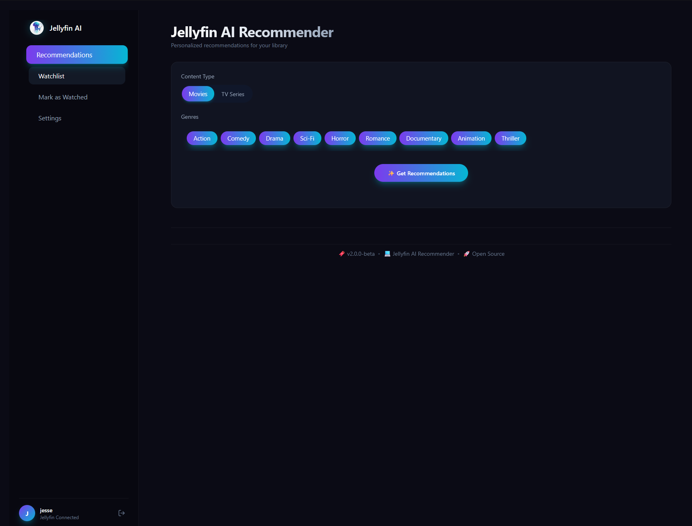

# 🎬 Jellyfin AI Recommender (v2.0.7)

A modern, AI-powered recommendation engine for your Jellyfin media server.
**Built with React (Vite), Node.js, TypeScript, and SQLite.**



## ✨ Features

- 🤖 **AI-Powered Discovery** — Uses **Google Gemini 2.5** to analyze your taste and find hidden gems you haven't seen yet.
- ✅ **"Trust No AI" Verification** — Every suggestion is strictly verified against Jellyseerr/TMDB to ensure valid metadata and functional links.
- 🧠 **Dynamic Taste Profile** — The system learns your preferences from your watch history and builds a text-based taste profile to guide the AI.
- 🚫 **Smart Filtering** — Automatically hides content you already own, have watched, or explicitly blocked.
- 📋 **Watchlist Management** — Organize your "To Watch" list with filtering (Movies vs. TV) and sorting.
- 🔗 **Jellyseerr Integration** — Request recommended media directly with one click (Optimistic UI).
- 💾 **Data Persistence** — Uses a local **SQLite** database (via Prisma) to store your history, ratings, and metadata safely.
- 🖼️ **Local Image Caching** — Downloads and serves all poster/backdrop images locally to prevent broken links when Jellyseerr IP changes.
- 📱 **Responsive Design** — Mobile-first UI with backdrop images on mobile, poster images on desktop.
- ⚙️ **UI Configuration** — Edit API keys and URLs directly in the browser via the Settings page.
- 🔄 **Legacy Import** — Non-destructive import tool to migrate data from the old v1 `database.json`.
- 🔧 **Production-Ready Rate Limiting** — Smart rate limiting supports large imports (1000+ items) with separate limits per operation type.
- 🌐 **Reverse Proxy Support** — Full support for Nginx, ZimaOS, and other reverse proxy environments with proper header forwarding.

## 🏗️ Architecture

This project is a full-stack monorepo split into a separate Frontend and Backend.

- **Frontend (`/frontend`)**: React + Vite + Tailwind CSS. Handles the UI, state management, and optimistic updates.
- **Backend (`/backend`)**: Node.js + Express + TypeScript. Handles API proxies, AI logic, database operations (Prisma), and Jellyseerr integration.
- **Database**: SQLite (`dev.db`) for user history and media metadata.

## 🚀 Quick Start

### 1. Prerequisites

- **Node.js** (v18+) & npm
- **Jellyfin Server** (accessible URL)
- **Jellyseerr Server** (for metadata enrichment & requests)
- **Google Gemini API Key** (for recommendations)

### 2. Installation

Clone the repo and install dependencies for both services:

```bash
git clone [https://github.com/jessepesse/jellyfin-ai-recommender.git](https://github.com/jessepesse/jellyfin-ai-recommender.git)
cd jellyfin-ai-recommender

# Install root tools (concurrently) and project dependencies
npm install
npm run install:all

### 3. Configuration (Two Options)

**Option A: Setup Wizard (Recommended)** Just start the app! You will be greeted by a Setup Wizard in the browser to enter your URLs and Keys. They will be saved to the local database.

**Option B: Environment Variables (Advanced)** Copy `backend/.env.example` to `backend/.env` and fill in your values:

cp backend/.env.example backend/.env
# Then edit backend/.env with your actual values

4. Database Setup

Initialize the SQLite database and apply the schema:

cd backend
npm run db:migrate
# This uses dotenv-cli to load your .env (if present) and run prisma migrate


5. Run the App (Development)

Start both the Frontend and Backend with a single command from the root directory:

npm run dev

Frontend (UI): http://localhost:5173
Backend (API): http://localhost:3001


🐳 Production (Docker)

This repo includes a production-ready `docker-compose.prod.yml`. It sets up the Node.js backend and serves the frontend via Nginx.

```bash
# Build and start containers
docker-compose -f docker-compose.prod.yml up -d --build
```

**Access:** The app is available at `http://localhost:5173` (frontend) and the backend API at `http://localhost:3001`.

**Persisted Data:**
- SQLite database: `./data/dev.db`
- Cached images: `./images/` (posters and backdrops)

**Initial Setup:**
After first run, migrate existing images to local cache:
```bash
docker-compose -f docker-compose.prod.yml exec backend npm run db:migrate-images
```

### 🔧 Docker Development (Hot Reload)

For development with Docker and automatic hot-reload, use the development compose file:

```bash
# Start development containers with hot reload
docker compose -f docker-compose.development.yml up --build

# Or in detached mode
docker compose -f docker-compose.development.yml up -d --build
```

**Features:**
- 🔄 **Hot Reload:** Code changes are automatically detected and reloaded
- 📁 **Source Mounting:** `src/` directories are mounted read-only into containers
- 🧪 **Isolated Dependencies:** `node_modules` stay inside containers
- 🐛 **Development Mode:** Full error messages and debugging output

**Development Access:**
- Frontend (Vite HMR): `http://localhost:5173`
- Backend API: `http://localhost:3001`

**View Logs:**
```bash
# All services
docker compose -f docker-compose.development.yml logs -f

# Backend only
docker compose -f docker-compose.development.yml logs -f backend-dev

# Frontend only  
docker compose -f docker-compose.development.yml logs -f frontend-dev
```

**Stop Development:**
```bash
docker compose -f docker-compose.development.yml down
```

## 🌐 Public Deployment & Security

If you plan to expose this application to the public internet (e.g., via Cloudflare Tunnel or Nginx Proxy Manager), you **must** configure the CORS policy to prevent security risks.

### 1. Set Allowed Domain
Edit your `docker-compose.prod.yml` and uncomment the `CORS_ORIGIN` line in the backend service:

```yaml
environment:
  - CORS_ORIGIN=https://ai.yourdomain.com
```

**Why this matters:** By default, the app only allows private networks (LAN IPs like 192.168.x.x). Without setting `CORS_ORIGIN`, public domains will be blocked. Setting this variable allows your specific domain while still blocking malicious sites.

### 2. Allow Custom Jellyseerr/Jellyfin Domains (SSRF Protection)

If your Jellyseerr or Jellyfin is hosted on a **custom domain** (not localhost or standard TMDB domains), you need to allowlist it to bypass SSRF protection:

```yaml
# In docker-compose.prod.yml, add to backend environment:
environment:
  - ALLOWED_IMAGE_DOMAINS=myjellyseerr.example.com,myjellyfin.example.com
```

**Format:** Comma-separated list of domains (no `http://`, no paths)  
**Default allowed:** `image.tmdb.org`, `themoviedb.org`, `localhost`, `127.0.0.1`, Docker network hosts

**Why this is needed:** The app has strict SSRF (Server-Side Request Forgery) protection that only allows requests to trusted domains. If you see errors like `[SSRF] Blocked request to non-allowlisted domain`, add your domain to this list.

### 3. Update Reverse Proxy
Ensure your reverse proxy (Nginx, Cloudflare, etc.) forwards the correct headers:
- `X-Real-IP`
- `X-Forwarded-For`
- `X-Forwarded-Proto`

See `frontend/nginx.conf` for a reference configuration.

📝 Usage Guide

    Login: Use your Jellyfin credentials. The app authenticates against your server.

    Get Recommendations:

        Select Movie or TV Series.

        Optionally select a Genre.

        Click "Get Recommendations". The AI will analyze your history and suggest 10 new items.

    Actions:

        👁️ Mark as Watched: Adds to your history.

        🔖 Add to Watchlist: Saves to your personal list.

        🚫 Block: Removes the item and signals the AI to avoid similar content.

        📥 Request: Sends a download request to Jellyseerr.

    Settings:

        System Config: Update your API keys/URLs at any time.

        Import: Paste your old database.json to migrate legacy data.

        Export: Download a backup of your current database.

## 🛠️ Maintenance & Utilities

### Image Cache Migration
If upgrading from v2.0.3 or earlier, run this to download all images locally:
```bash
# Development
cd backend
npm run db:migrate-images

# Docker
docker-compose -f docker-compose.prod.yml exec backend npm run db:migrate-images
```

### Database Backup
Export your database to JSON:
```bash
# Development
cd backend
npm run db:backup

# Docker
docker-compose -f docker-compose.prod.yml exec backend npm run db:backup
```

Backups are saved to `./data/backup_latest.json` and timestamped files.

## 🔒 Security

This project implements comprehensive security measures including:
- 5-layer SSRF (Server-Side Request Forgery) protection
- Input validation with Zod schemas
- Rate limiting on all endpoints
- Security headers via Helmet
- Strict CORS policy with private network allowlist
- Local image caching (eliminates external URL dependencies)
- No sensitive data logging

**For security policy and known CodeQL alerts, see [SECURITY.md](SECURITY.md)**

## 📄 License

This project is licensed under the GNU Affero General Public License v3.0 (AGPLv3).

    ✅ Personal & Commercial use allowed

    ⚠️ Modifications must be open-sourced if distributed/hosted for others.

    See LICENSE for details.

---
Made with ❤️ for Jellyfin enthusiasts.