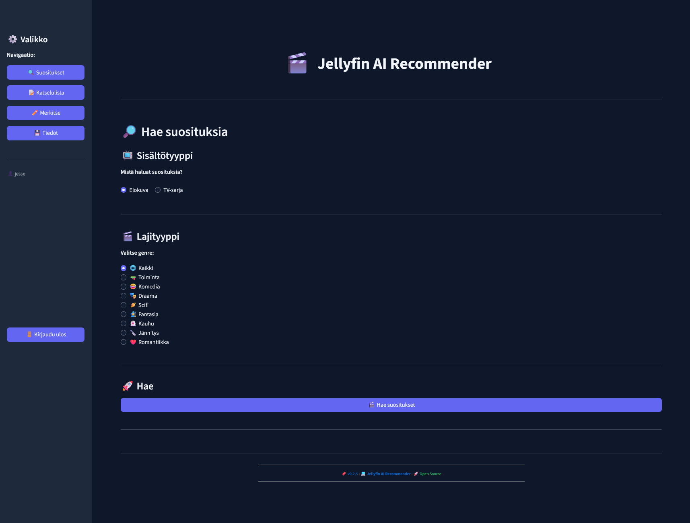

# 🎬 Jellyfin AI Recommender

Personalized movie and TV show recommendation engine powered by **Google Gemini AI**, **Jellyfin**, and **Jellyseerr**.



## ✨ Features

- 🤖 **AI-Powered Recommendations** — Uses Google Gemini to generate personalized suggestions
- 🎥 **Jellyfin Integration** — Reads your watch history directly from Jellyfin
- 📋 **Watchlist Management** — Save recommendations to a personal watchlist
- 🚫 **Blacklist Control** — Mark content you don't want recommendations for
- 🎯 **Genre Filtering** — Filter recommendations by genre
- 🔗 **Jellyseerr Integration** — Request media directly from Jellyseerr with one click
- 📊 **Manual Tracking** — Add movies/series watched outside Jellyfin
- 💾 **Database Backup** — Export and import your personal data

## 🚀 Quick Start

### Prerequisites

- Docker & Docker Compose (for containerized setup)
- OR Python 3.9+ (for local development)
- Jellyfin instance
- Jellyseerr instance (optional, for media requests)
- Google Gemini API key

### Option 1: Docker (Recommended)

**Fastest setup:**

```bash
# Clone repository
git clone https://github.com/yourusername/jellyfin-ai-recommender.git
cd jellyfin-ai-recommender

# Create environment file
cp .env.example .env
# Edit .env with your Jellyfin, Jellyseerr, and Gemini API credentials

# Start with Docker Compose
docker-compose up -d

# Access the app
# http://<your-server-ip>:8501
```

**View logs:**
```bash
docker-compose logs -f recommender
```

**Stop application:**
```bash
docker-compose down
```

### Option 2: Local Development

**For development or testing:**

```bash
# Clone repository
git clone https://github.com/yourusername/jellyfin-ai-recommender.git
cd jellyfin-ai-recommender

# Create virtual environment
python -m venv venv
source venv/bin/activate  # On Windows: venv\Scripts\activate

# Install dependencies
pip install -r requirements.txt

# Create environment file
cp .env.example .env
# Edit .env with your credentials

# Run application
streamlit run app.py
```

Access at `http://localhost:8501`

## 📖 Documentation

- [Setup Guide](SETUP.md) — Detailed installation & configuration
- [API Integration](API_INTEGRATION.md) — External service integration details
- [Database Schema](DATABASE_SCHEMA.md) — User data structure reference
- [Copilot Instructions](.github/copilot-instructions.md) — AI agent guidelines

## 🐳 Docker Deployment

### Docker Compose Configuration

The `docker-compose.yml` handles all setup automatically:

```yaml
version: '3.8'
services:
  recommender:
    build: .
    ports:
      - "8501:8501"
    environment:
      - JELLYFIN_URL=${JELLYFIN_URL}
      - JELLYSEERR_URL=${JELLYSEERR_URL}
      - JELLYSEERR_API_KEY=${JELLYSEERR_API_KEY}
      - GEMINI_API_KEY=${GEMINI_API_KEY}
    volumes:
      - ./database.json:/app/database.json
    restart: unless-stopped
```

### Environment Variables (Docker)

Set in `.env` file:

```env
JELLYFIN_URL=http://your-jellyfin-ip:8096
JELLYSEERR_URL=http://your-jellyseerr-ip:5055
JELLYSEERR_API_KEY=your_api_key
GEMINI_API_KEY=your_gemini_key
```

### Persistent Data

The `database.json` is mounted as a volume to persist user data between container restarts.

## 🔧 Configuration

See [SETUP.md](SETUP.md) for detailed environment variable configuration.

## 📝 Usage

1. **Login** with your Jellyfin credentials
2. **Select media type** (Movies or TV Series)
3. **Choose genre** (optional)
4. **Click "Hae suositukset"** to generate recommendations
5. **Manage recommendations:**
   - ✅ Request via Jellyseerr
   - 👁️ Mark as watched
   - 🚫 Block from future recommendations
   - 🔖 Add to watchlist
6. **Backup your data:**
   - 📥 Export as JSON file
   - 📤 Import previously exported backup

## 🏗️ Architecture

```
Jellyfin → Watch History → AI Recommendations → Jellyseerr (requests)
           Manual Tracking ↓
           Database (JSON) → Watchlist, Blacklist, Backup/Restore
```

## 📄 License

This project is licensed under the **GNU Affero General Public License v3.0** (AGPLv3).

### What this means:
- ✅ **Commercial use is allowed** — You can use this for business purposes
- ✅ **Modification is allowed** — You can modify the code for your needs
- ✅ **Distribution is allowed** — You can distribute modified versions
- ✅ **Network use triggers sharing** — If you run this as a web service, you must provide source code to users
- ⚠️ **Source code must be shared** — Any distributed version must include source code
- ⚠️ **Same license applies** — Modifications must also be licensed under AGPLv3

### Key difference from GPLv3:
AGPLv3 closes the "**SaaS loophole**" — even if you don't distribute the software, if you offer it as a service over a network (like a web app), you must make the source code available to users.

For full details, see the [LICENSE](LICENSE) file.

## 🤝 Contributing

This is a personal project. Contributions are welcome! Feel free to fork, modify, and share improvements while maintaining the AGPLv3 license.

## ⚙️ Tech Stack

- **Frontend:** Streamlit (Python)
- **AI:** Google Generative AI (Gemini)
- **Media Sources:** Jellyfin, Jellyseerr
- **Storage:** JSON-based user database
- **Deployment:** Docker & Docker Compose

## 🐛 Troubleshooting

### Docker Issues

**Container won't start:**
```bash
docker-compose logs recommender
```

**Port 8501 already in use:**
```bash
# Edit docker-compose.yml to use different port
ports:
  - "8502:8501"  # Use 8502 instead
```

**Database file permissions:**
```bash
chmod 666 database.json
```

### Connection Issues

**Error: "Yhteys Jellyfin-palvelimeen epäonnistui"**
- Verify `JELLYFIN_URL` is correct (e.g., `http://192.168.1.x:8096`)
- Check Jellyfin is running and accessible from container
- Verify firewall allows connections

**Error: "Ei löytynyt sopivaa mediaa"**
- Jellyseerr might not be configured
- Check `JELLYSEERR_API_KEY` is correct
- Verify Jellyseerr has media library indexed

### API Key Issues

**Error: "Gemini API-avainta ei ole asetettu"**
- `GEMINI_API_KEY` is missing in `.env`
- Verify key is valid (test in Google AI Studio)

### Backup & Restore Issues

**Error: "Tietokanta kuuluu eri käyttäjälle"**
- Make sure you're importing a backup file that belongs to the currently logged-in user
- Export creates user-specific backups

---

Made with ❤️ for Jellyfin enthusiasts